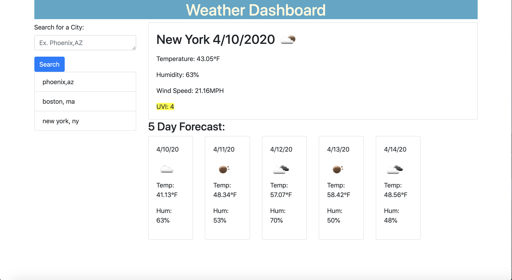

# Week6Homework

A weather dashboard. Enter the city, state you wish to view the weather for and be presented with the current date, temperature, humidity, wind speed, and UVI index with a color code based on the severity. The 5 day forecast is presented below displaying the date, temperature, and humidity.

The cities the user searches are stored and retrievable by clicking on the listed names.

https://nmosch.github.io/Weather-Dashboard/

